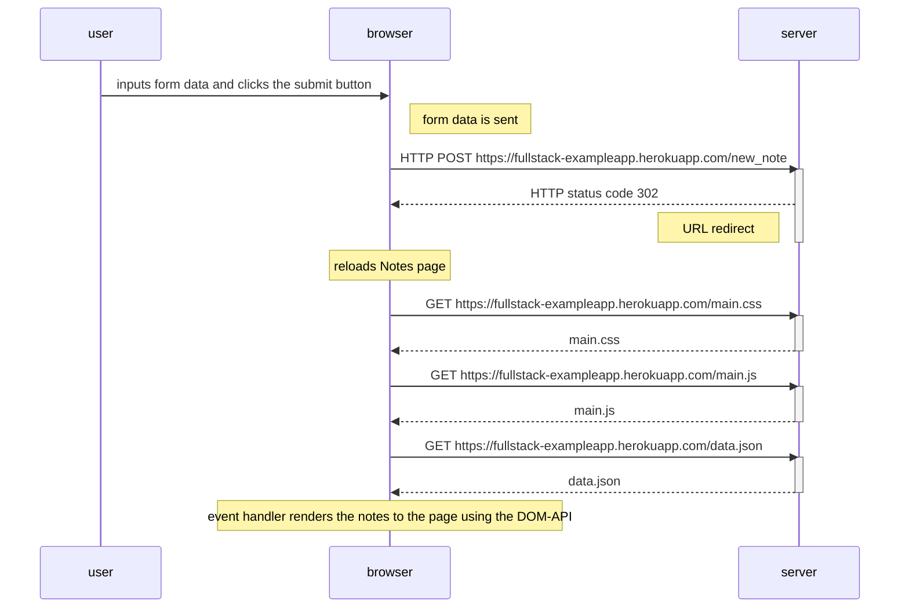

```mermaid
sequenceDiagram
    participant user
    participant browser
    participant server

    user->>browser: inputs form data and clicks the submit button

    Note right of browser: form data is sent

    browser->>server: HTTP POST https://fullstack-exampleapp.herokuapp.com/new_note
    activate server
    server-->>browser: HTTP status code 302
    Note left of server: URL redirect
    deactivate server

    Note over browser: reloads Notes page

    browser->>server: GET https://fullstack-exampleapp.herokuapp.com/main.css
    activate server
    server-->>browser: main.css
    deactivate server

    browser->>server: GET https://fullstack-exampleapp.herokuapp.com/main.js
    activate server
    server-->>browser: main.js
    deactivate server

    browser->>server: GET https://fullstack-exampleapp.herokuapp.com/data.json
    activate server
    server-->>browser: data.json
    deactivate server

    Note over browser: event handler renders the notes to the page using the DOM-API

```
