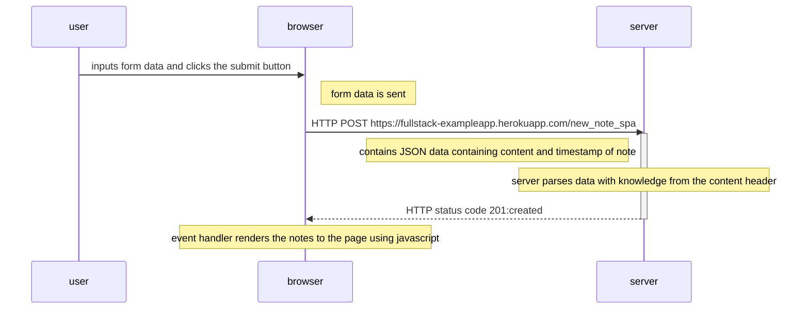

```mermaid
sequenceDiagram
    participant user
    participant browser
    participant server

    user->>browser: inputs form data and clicks the submit button

    Note right of browser: form data is sent

    browser->>server: HTTP POST https://fullstack-exampleapp.herokuapp.com/new_note_spa
    activate server
    Note left of server: contains JSON data containing content and timestamp of note
    Note over server: server parses data with knowledge from the content header
    server-->>browser: HTTP status code 201:created
    deactivate server

    Note over browser: event handler renders the notes to the page using javascript
    
```